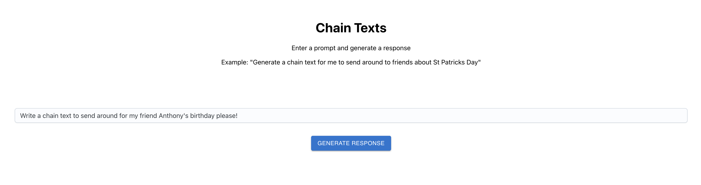

# Chain Message Generator

Overall this is dead simple, throw your prompt into the prompt.txt file and run the app. It will generate a chain message for you
using whatever extra information that it can find in the knowledge base.

I have left out the extra data that I have trained on because it is not my data to share. If you would like to train your own model
you can aggregate your own data and train it by running the service and using the /train endpoint.



You can do two simple things here, update the models knowledge base and post a query to generate a chain message. Both require
the presence of an OpenAI API key. You can get one by signing up for the beta at https://beta.openai.com/signup/.

This must be set in your ENV to `OPENAI_API_KEY`.

## Installation

This app is run using poetry, a python package manager. To install dependencies using poetry, run the following command:
```
% poetry install && poetry update
```

## Running the Chain Texts App

If you have not already, generate the Open API client code for the front end using the following command:
```
openapi-generator generate -i http://localhost:8000/openapi.json -g typescript-fetch -o my-app/src/api
```
Run backend:
```
poetry run uvicorn service:app --reload
```
Run frontend
```
cd my-app && npm start
```

## Docs 

To view the API documentation, navigate to http://localhost:8000/docs